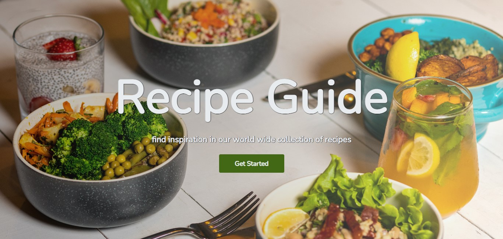
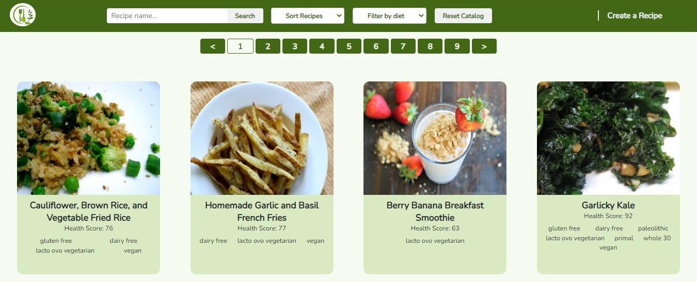
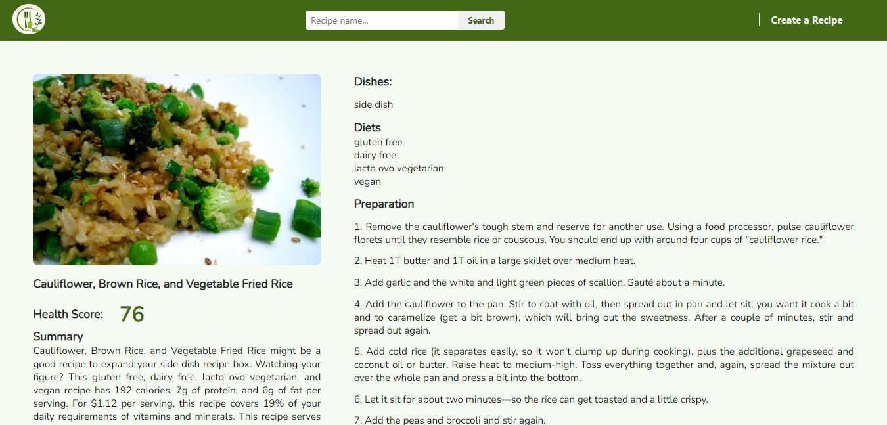
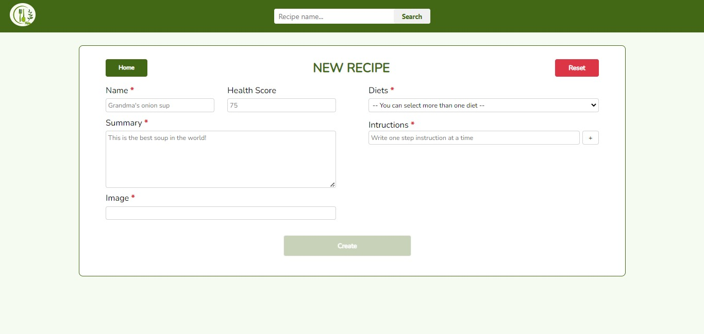

# Welcome to Food Guide

## Overview

This project was an integration of all the knowledge and skills adquired during the course of the Henry bootcamp. It is a Full Stack application developed with the PERN stack, implementing Sequelize to manage the data base. It consists of four main views:

1. Landing Page

<p align="center">
  
</p>

2. Catalog

A catalog of recipes with search functionality, filters and sorting.

<p align="center">
  
</p>

3. Details page

Detailed information about each recipe.

<p align="center">
  
</p>

4. Recipe creation

Controlled and JavaScript validated Form to create new recipes.

<p align="center">
  
</p>

## Local Set Up

You'll need to have a modern Browser, Git, NodeJS and PostgreSQL installed in your machine for this app to work locally. When you meet those requirements proceed with the steps bellow.

1. Clone this repo to your local machine.

```sh
git clone https://github.com/madrizjosea/recipe-guide.git
```

2. Create an account on the [spoonacular](https://spoonacular.com/food-api) API so you have access to an API key

3. On a terminal window of your preference navigate to the path where you cloned the repo.

4. On each folder create a .env file following the instructions in their respective .env.example files.

5. Using the shell or GUI from your postgres data base create a new database to which you'll have to make reference in the api .env file.

6. Open a terminal for each of the folders in the repo -- api and client.

7. On each prompt run the command "npm install" to set up the project dependicies.

```sh
npm install
```

8. On the terminal prompt in the api folder run the command

```sh
npm run dev
```

9. On the terminal prompt in the client folder run the command

```sh
npm start
```

The app will launch on your default browser.
